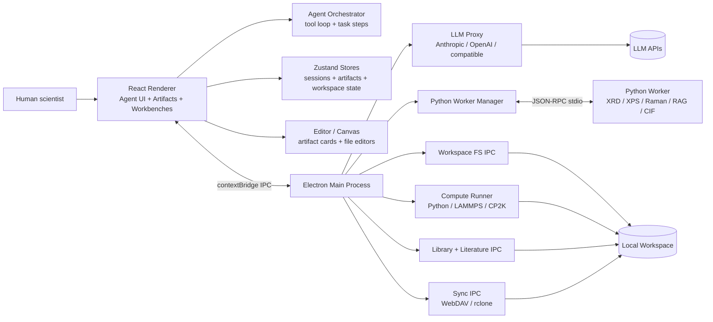
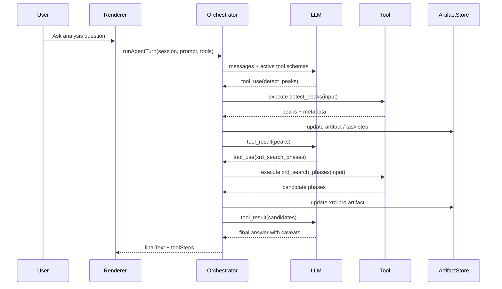
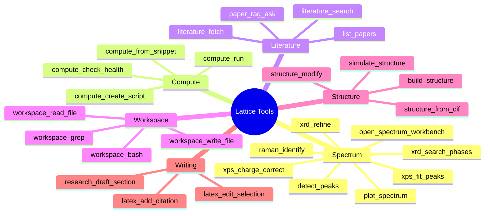
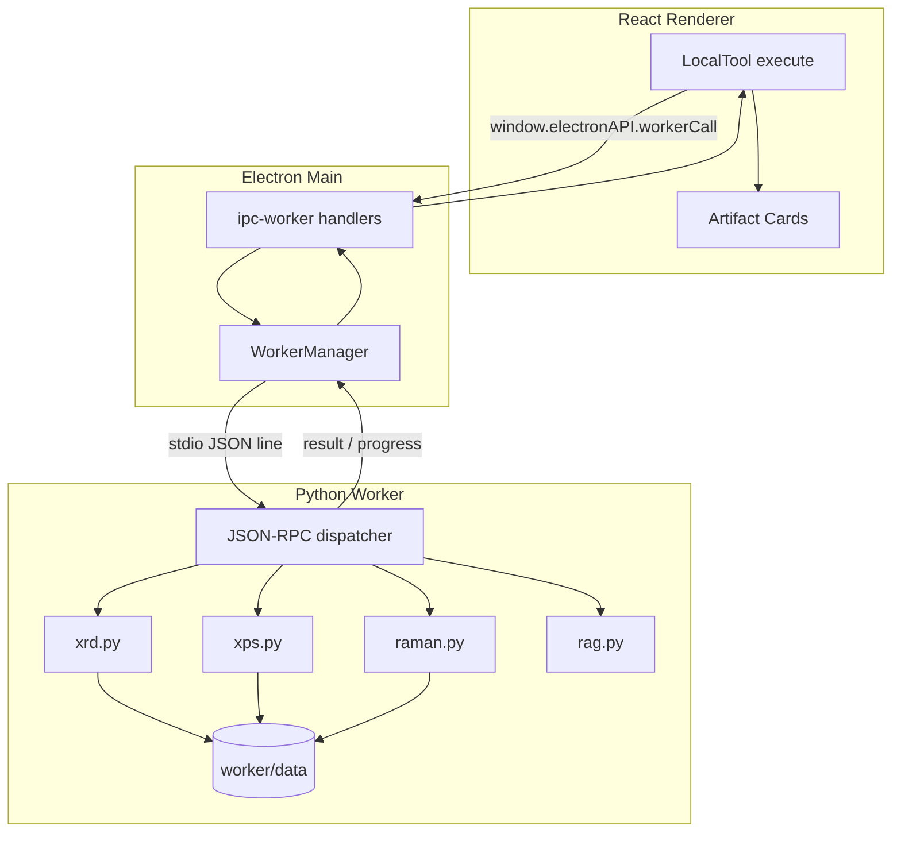
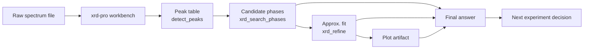
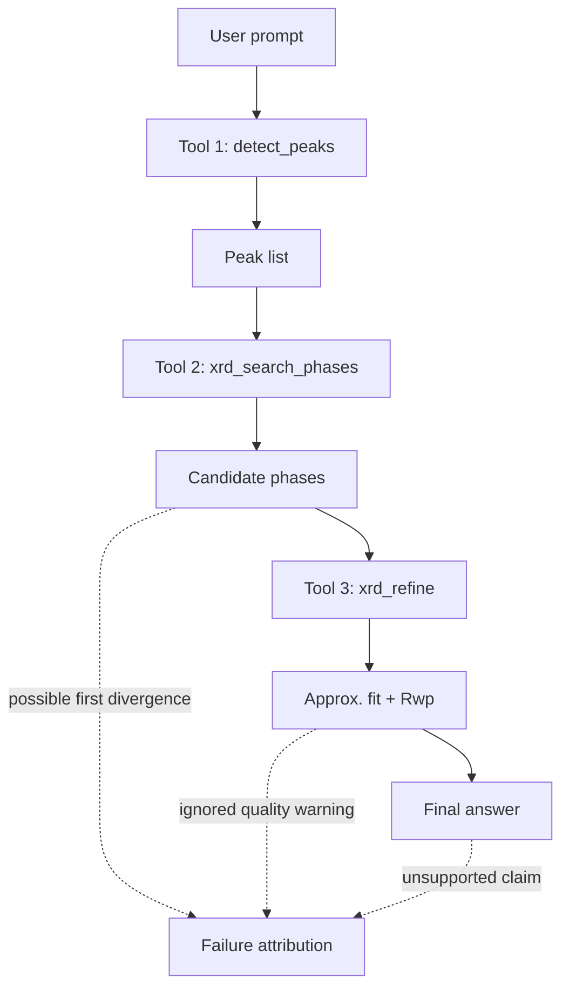

# Lattice-app 架构介绍与可视化方案

> Draft v2 — 2026-04-29  
> 用途：作为论文 System Design 章节的扩展底稿，也可拆成 Fig. 1 / Fig. 2 / Supplementary architecture note。  
> 主叙事：Lattice 不是 autonomous materials discovery engine，而是帮助人类科学家更快完成 `characterize -> interpret -> decide next experiment` 的 tool-grounded scientific workspace。

---

## 1. 架构定位

Lattice-app 的核心不是单个算法，也不是一个聊天界面。它是一个 local-first scientific agent workspace，把以下对象放在同一个可审计循环里：

- LLM agent：负责理解任务、规划步骤、调用工具、总结结果。
- Materials characterization tools：XRD / XPS / Raman / spectrum analysis。
- Compute tools：Python / LAMMPS / CP2K / ASE 等脚本执行与结果捕获。
- Literature tools：文献搜索、PDF 导入、paper RAG、引用与报告生成。
- Artifact workspace：把谱图、拟合结果、结构、compute logs、paper、report 等保存成可复用对象。
- Human approval gates：对写文件、执行脚本、可编辑分析结果等步骤做人工确认。
- Trace / task steps：记录工具名、输入、输出、状态和关联 artifacts，支撑后续审计和复现。

Lattice 的系统目标可以概括为：

> 把 AI 从“直接给材料发现答案”的角色，转成“组织实验反馈证据、调用科学工具、保存中间产物、辅助人类决定下一轮实验”的工作流加速器。

---

## 2. 顶层运行时结构

Lattice 当前由三个主要运行时组成。

| 层 | 主要代码位置 | 责任 |
|---|---|---|
| React renderer | `src/` | UI、agent orchestrator、Zustand stores、artifact cards、workspace editor |
| Electron main process | `electron/` | IPC bridge、LLM proxy、Python worker manager、compute runner、workspace FS、library、sync |
| Python worker | `worker/` | JSON-RPC scientific tools：XRD/XPS/Raman/spectrum/RAG/PDF/CIF 等 |

辅助外部系统：

- LLM providers：Anthropic / OpenAI / OpenAI-compatible path，经 `electron/llm-proxy.ts` 调用。
- Literature / metadata services：OpenAlex / Crossref / arXiv 等，经 Electron IPC 或 local tools 调用。
- Workspace filesystem：本地目录，经过 `IWorkspaceFs` 抽象读写。
- Optional sync backend：WebDAV / rclone，用于跨设备同步。

### 可视化方案：Fig. 1 System Context

建议做成论文第一张架构图。左侧是 user / scientist，中间是 Lattice desktop app，右侧是外部服务，底部是本地 workspace 和 Python worker。



图注建议：

> Lattice runs as a local Electron application. The renderer owns the scientific workspace and agent loop, while the Electron main process mediates privileged operations: LLM calls, filesystem access, scientific worker execution, compute jobs, library access, and sync.

---

## 3. Agent Orchestrator：从聊天到工具执行

核心文件：

- `src/lib/agent-orchestrator.ts`
- `src/lib/agent-orchestrator/types.ts`
- `src/lib/agent-orchestrator/tool-loop.ts`
- `src/lib/agent-orchestrator/approval.ts`
- `src/lib/llm-chat.ts`
- `src/lib/llm-chat/messages.ts`

Agent orchestrator 是 Lattice 从普通 chat app 变成 scientific workflow app 的核心。它执行一个受控的多轮 loop：

1. 从当前 session transcript 和用户输入构造 LLM messages。
2. 根据上下文筛选当前可用 tools。
3. 通过 `sendLlmChat()` 调用 provider。
4. 如果模型返回文本，结束本轮，生成 final answer。
5. 如果模型返回 tool calls，逐个执行 local tool。
6. 每个 tool call 生成 task step，记录 input / output / status。
7. 将 tool result 作为下一轮 LLM 输入，再次调用模型。
8. 遇到 abort、loop detection、iteration ceiling 或 provider error 时停止。

关键特性：

- **Bounded execution**：有最大迭代次数和 loop detector，避免无限调用工具。
- **Provider-neutral tool schema**：工具由 TypeScript `LocalTool` 定义，序列化后传给 Anthropic / OpenAI-style tool calling。
- **Context-aware tool filtering**：根据 session artifacts 和 user message，只暴露相关工具组，降低模型误用工具的概率。
- **Task step capture**：工具调用不是隐藏的后台操作，而是 task timeline 中的结构化步骤。
- **Abort propagation**：用户取消会通过 `AbortSignal` 传到 LLM call 和工具执行。
- **Micro-compaction**：长工具链中旧的 retrieval results 可被清理，避免上下文膨胀。

### 可视化方案：Fig. 2 Agent Loop Sequence

用 sequence diagram 展示一次 XRD 或 XPS workflow 的 agent loop。



图注建议：

> Lattice preserves the tool-mediated evidence path. The final answer is generated only after intermediate tool outputs have been returned to the model and materialized as task steps/artifacts.

---

## 4. Tool Catalog：统一工具接口

核心文件：

- `src/types/agent-tool.ts`
- `src/lib/agent-tools/index.ts`
- `src/lib/agent-tools/*`

每个 Lattice local tool 都实现同一个 `LocalTool` contract：

- `name`
- `description`
- `inputSchema`
- `trustLevel`
- `cardMode`
- `contextParams`
- `planModeAllowed`
- `execute(input, ctx)`

工具分组大致包括：

| 工具组 | 代表工具 | 作用 |
|---|---|---|
| Core / meta | `tool_search`, `task_create`, `ask_user_question` | 工具发现、任务管理、澄清问题 |
| Workspace | `workspace_read_file`, `workspace_grep`, `workspace_write_file`, `workspace_bash` | 本地文件读写与命令执行 |
| Spectrum | `open_spectrum_workbench`, `detect_peaks`, `xrd_search_phases`, `xrd_refine`, `xps_fit_peaks`, `raman_identify` | 材料表征分析 |
| Compute | `compute_check_health`, `compute_create_script`, `compute_run`, `compute_from_snippet` | 脚本生成、执行、监控 |
| Structure | `structure_from_cif`, `build_structure`, `structure_modify`, `simulate_structure` | 晶体结构和模拟准备 |
| Literature / library | `literature_search`, `literature_fetch`, `paper_rag_ask`, `list_papers` | 文献搜索、PDF 导入、RAG |
| Research / writing | `research_plan_outline`, `research_draft_section`, `research_finalize_report` | 报告生成 |
| LaTeX | `latex_edit_selection`, `latex_fix_compile_error`, `latex_add_citation` | 论文写作和编译修复 |
| Hypothesis | `hypothesis_create`, `hypothesis_gather_evidence`, `hypothesis_evaluate` | 假设管理 |

设计重点：

- LLM 不能直接访问任意代码路径，必须通过 tool schema。
- 每个工具声明风险等级，orchestrator 根据 permission mode 决定是否执行。
- 工具结果进入 task steps，并可产生或修改 artifacts。
- 对于谱图类任务，很多工具不是返回纯文本，而是更新 `xrd-pro` / `xps-pro` / `raman-pro` workbench artifact。

### 可视化方案：Tool Taxonomy

建议做成 supplementary figure 或论文 Table 1 的图形版。



---

## 5. Python Worker：科学计算边界

核心文件：

- `worker/main.py`
- `worker/tools/__init__.py`
- `worker/tools/xrd.py`
- `worker/tools/xps.py`
- `worker/tools/raman.py`
- `worker/tools/spectrum.py`
- `worker/tools/rag.py`
- `worker/tools/cif_db.py`
- `electron/worker-manager.ts`
- `electron/ipc-worker.ts`

Python worker 是 Lattice 中科学计算的隔离边界。Electron main process 懒加载 worker，renderer 通过 IPC 调用 `worker:call`，main process 再通过 stdio JSON-RPC 调用 Python worker。

Worker 注册的方法约 22 个，覆盖：

- `spectrum.detect_peaks`
- `spectrum.assess_quality`
- `spectrum.smooth`
- `spectrum.baseline`
- `xrd.search`
- `xrd.refine`
- `xrd.refine_dara`
- `xps.lookup`
- `xps.charge_correct`
- `xps.fit`
- `xps.quantify`
- `xps.validate`
- `raman.identify`
- `paper.read_pdf`
- `rag.retrieve`
- `cif_db.get`
- `cif_db.search`
- `cif_db.stats`
- `web.fetch`
- `web.search`
- `library.fetch_doi`
- `system.echo`

设计意义：

- 科学数值计算不由 LLM 文本生成，而由 Python 工具执行。
- Python 依赖和算法留在 worker 环境中，renderer 只做 UI 和 orchestration。
- Worker stdout 是 JSON-RPC 协议通道，stderr 用于日志。
- 长任务可通过 progress event 向前端报告状态。
- XRD / XPS / Raman reference data 保存在 `worker/data/`，支持离线或半离线分析。

重要准确表述：

- 当前 `xrd.refine` 是 approximate whole-pattern / pseudo-Voigt / isotropic fitting，不应写成 full Rietveld。
- BGMN / DARA 相关能力通过 `xrd.refine_dara` bridge 表达，和 offline approximate refinement 区分开。

### 可视化方案：Process Boundary + IPC



---

## 6. Compute Runner：可复现脚本执行

核心文件：

- `electron/compute-runner.ts`
- `electron/ipc-compute.ts`
- `electron/conda-env-manager.ts`
- `src/lib/agent-tools/compute-create-script.ts`
- `src/lib/agent-tools/compute-run.ts`
- `src/lib/agent-tools/compute-from-snippet.ts`

Compute runner 与 Python worker 是两个不同系统：

- Python worker：执行内置科学工具，如 XRD / XPS / Raman / RAG。
- Compute runner：执行用户或 agent 生成的脚本 / input deck，如 Python、LAMMPS、CP2K。

典型 compute workflow：

1. Agent 调用 `compute_check_health` 检查环境。
2. Agent 调用 `compute_create_script` 或 `compute_from_snippet` 创建 compute artifact。
3. 用户可在卡片里查看/编辑脚本。
4. Agent 或用户调用 `compute_run` 执行脚本。
5. Electron main process 启动子进程，捕获 stdout / stderr / exit status。
6. 结果写回 compute artifact，并可保存 run directory。

设计意义：

- 脚本本身作为 artifact 保存，可复查和复跑。
- 执行输出、错误日志、图像 sentinel 都进入 artifact 或 run folder。
- `compute_run` 属于 `hostExec` 风险等级，应受 permission gate 控制。
- 长任务可以后台运行，避免 agent 等待 DFT/MD 等耗时作业。

---

## 7. Artifact-Centered Workspace：从聊天记录到证据对象

核心文件：

- `src/types/artifact.ts`
- `src/stores/runtime-store.ts`
- `src/components/canvas/artifact-body.tsx`
- `src/components/canvas/artifact-body/kind-renderers.tsx`
- `src/components/canvas/artifacts/*`

Lattice 的一个关键设计是：工具输出不是只以文本形式进入聊天，而是尽量 materialize 为 typed artifact。

主要 artifact families：

| Family | Kinds |
|---|---|
| Spectroscopy results | `spectrum`, `peak-fit`, `xrd-analysis`, `xps-analysis`, `raman-id`, `curve-analysis` |
| Interactive workbenches | `xrd-pro`, `xps-pro`, `raman-pro`, `curve-pro`, `spectrum-pro`, `compute-pro` |
| Compute / workflow | `compute`, `compute-experiment`, `job`, `batch`, `optimization` |
| Research objects | `paper`, `research-report`, `latex-document`, `hypothesis` |
| Structure / comparison | `structure`, `material-comparison`, `similarity-matrix` |
| Plotting | `plot` |

每个 artifact 都有统一 envelope：

- `id`
- `kind`
- `title`
- `createdAt`
- `updatedAt`
- `sourceStepId`
- `sourceFile`
- `parents`
- `params`
- `payload`

这使得 Lattice 能把一次实验解释转成证据图谱：

```text
raw spectrum file
  -> xrd-pro workbench
    -> detect_peaks result
      -> phase candidates
        -> approximate fit
          -> plot artifact
            -> final answer / report section
```

### 可视化方案：Artifact DAG



图注建议：

> Lattice represents scientific work as an artifact graph rather than a linear chat transcript. Intermediate artifacts can be inspected, edited, cited, or reused in later steps.

---

## 8. Workspace Filesystem 与 Persistence

核心文件：

- `src/stores/workspace-store.ts`
- `src/lib/workspace/fs/*`
- `electron/ipc-workspace.ts`
- `electron/ipc-workspace-root.ts`
- `src/lib/workspace/envelope.ts`
- `src/lib/workspace/file-kind.ts`

Lattice 现在有两类持久化路径：

1. **Runtime/session persistence**
   - Zustand `runtime-store` 管理 sessions、transcripts、artifacts、tasks。
   - 使用 localStorage 持久化，并对大对象 fallback 到 IndexedDB。
   - 用于 app session 级别状态。

2. **Workspace filesystem**
   - 用户选择本地 workspace root。
   - `IWorkspaceFs` 抽象读写文件。
   - Electron backend 实际访问磁盘；memory backend 支持 browser preview / tests。
   - workspace 文件通过 file-kind 分类，被 editor 和 agent tools 读取。

`OrchestratorCtx` 是连接 agent 和 workspace 的关键 seam：

- `emitArtifact(kind, payload)`
- `emitTextFile(relPath, text)`
- `emitStructureArtifact(cifText, meta)`
- `emitTranscript(message)`
- `openFile(relPath)`

设计意义：

- 一些工具可以从“只写 runtime store”迁移到“写 workspace envelope”。
- workspace 文件可被 editor 打开、被 agent mention、被后续工具引用。
- 这让 Lattice 逐渐从 session-local app 走向 project-local scientific workspace。

---

## 9. LLM Provider Path 与上下文管理

核心文件：

- `src/lib/llm-chat.ts`
- `src/lib/llm-chat/messages.ts`
- `src/lib/llm-chat/history-budget.ts`
- `src/lib/llm-chat/mentions.ts`
- `electron/llm-proxy.ts`
- `electron/anthropic-client.ts`
- `electron/llm-stream.ts`

Lattice 的 LLM 调用由 renderer 发起，但实际 HTTP 请求在 Electron main process 中执行。原因：

- 避免 renderer CSP 限制。
- 避免在 browser-only preview 中误用不可用功能。
- 统一 provider 请求格式。
- 支持 Anthropic streaming path。
- 让 API key 经过本地配置，不在工具层散落。

上下文构造包括：

- system prompt
- transcript history
- current user message
- attached images
- mention context blocks
- tool schemas
- model routing overrides
- token budget trimming
- old tool-result micro-compaction

Provider 支持策略：

- 当前可靠路径是 Anthropic / OpenAI / OpenAI-compatible。
- 不应在论文中写 Google/Gemini 原生支持，除非实际补 provider adapter。
- Agent mode 要求模型支持 tool/function calling。

---

## 10. Human-in-the-loop Safety：Permission + Approval

核心文件：

- `src/types/permission-mode.ts`
- `src/types/agent-tool.ts`
- `src/lib/agent-orchestrator/approval.ts`
- `src/stores/agent-dialog-store.ts`
- `src/components/agent/cards/*`

Lattice 用两层机制控制风险。

### 10.1 Trust level

每个 tool 声明 `trustLevel`：

| Level | 含义 | 例子 |
|---|---|---|
| `safe` | 只读或纯 UI/metadata | list/read/search 类 |
| `sandboxed` | 受限后台操作 | web/literature/sub-agent 等 |
| `localWrite` | 修改 artifacts/session/workspace proposal | peak detection update、write proposal、plot |
| `hostExec` | 执行脚本或 shell | `compute_run`, `workspace_bash` |

### 10.2 Card mode

每个 tool 还声明 `cardMode`：

| Mode | 含义 |
|---|---|
| `silent` | 不显示卡片，只保留 trace |
| `info` | 显示只读结果 |
| `review` | 需要 approve/reject |
| `edit` | 允许用户编辑结果后再 approve |

### 10.3 Permission mode

Session 级别有四种 permission mode：

| Mode | 行为 |
|---|---|
| `normal` | 对写入和执行类工具询问 |
| `auto-accept` | 自动通过 proposal/review 类卡片，但 hostExec 仍询问 |
| `read-only` | 阻止非只读工具 |
| `yolo` | 跳过所有 gate |

### 可视化方案：Approval Matrix

建议用表格图，不一定用 Mermaid。论文中可放一个 2D matrix：

| Permission mode | safe | sandboxed | localWrite | hostExec | review/edit cards |
|---|---|---|---|---|---|
| normal | auto | auto | ask | ask | ask |
| auto-accept | auto | auto | auto | ask | auto |
| read-only | auto | auto | deny | deny | deny |
| yolo | auto | auto | auto | auto | auto |

图注建议：

> Lattice separates tool risk from session policy. This lets scientists choose between conservative review and high-throughput evaluation runs without changing tool implementations.

---

## 11. Task Steps 与 Traceability

核心文件：

- `src/types/session.ts`
- `src/lib/agent-orchestrator/tool-loop.ts`
- `src/hooks/useWebSocket.ts`
- `src/lib/conversation-export.ts`

每个工具调用会生成一个 task step，包含：

- step id
- tool name
- raw input
- output summary
- raw output
- status
- approval state
- edited output
- linked artifact refs
- start/end time

这让 Lattice 可以回答论文中最关键的问题：

> 这个 AI 结论是从哪里来的？哪些工具产生了证据？人类在哪里介入？如果结论错了，错误是在工具层还是 LLM 解读层？

注意当前实现边界：

- Persisted chat transcript 主要保存 user / assistant 文本和部分 task linkage。
- 完整 provider-level `tool_use/tool_result` 并不是跨 session 持久化的正式 replay log。
- 更准确的论文表述应是：Lattice captures tool steps, tool inputs/outputs, artifacts, and final responses during agent execution。
- 若要做严格 replay，需要新增 export task steps / artifact DAG 的 evaluation exporter。

### 可视化方案：Failure Attribution Trace



---

## 12. Pro Workbenches：材料表征的交互层

核心目录：

- `src/components/canvas/artifacts/pro/*`
- `src/components/canvas/artifacts/XrdProWorkbench.panel.tsx`
- `src/components/canvas/artifacts/XpsProWorkbench.panel.tsx`
- `src/components/canvas/artifacts/RamanProWorkbench.panel.tsx`
- `src/lib/pro-workbench/*`

Pro workbench 是 Lattice 区别于普通 agent wrapper 的关键 UI：

- `xrd-pro` 保存 XRD 数据、参数、phase search、refine result、history。
- `xps-pro` 保存 XPS 数据、charge correction、fit components、quantification。
- `raman-pro` 保存 Raman spectrum、matches、peak state。
- `curve-pro` / `spectrum-pro` 支撑更一般的谱图处理。

Agent tools 不只是返回文本，而是对 workbench payload 做 patch：

- `detect_peaks` 更新 peak table。
- `xrd_search_phases` 更新候选 phase list。
- `xrd_refine` 更新 approximate fit result。
- `xps_fit_peaks` 更新 components 和 fit result。
- `raman_identify` 更新 ranked matches。
- `plot_spectrum` 生成独立 plot artifact。

这使 scientist 可以在 UI 中检查、调整、导出，而不是只能读 agent 总结。

### 可视化方案：Workbench Screenshot Panel

建议 Fig. 3 用真实 app 截图拼成三栏：

1. XRD Pro：原始谱图 + peak markers + phase candidates。
2. XPS Pro：fit components + charge correction / quantification panel。
3. Raman Pro：detected peaks + ranked library matches。

每栏标注：

- input
- tools called
- artifact produced
- human review point
- next-step decision

---

## 13. Library / Literature / Research Layer

核心文件：

- `electron/literature-search.ts`
- `electron/ipc-literature.ts`
- `electron/ipc-library.ts`
- `src/lib/local-pro-library/*`
- `src/lib/agent-tools/literature-search.ts`
- `src/lib/agent-tools/literature-fetch.ts`
- `src/lib/agent-tools/paper-rag-ask.ts`
- `src/components/library/*`

这层解决实验迭代中的另一个瓶颈：表征结果需要和文献证据连接。

能力包括：

- 文献搜索。
- Open-access PDF 下载和导入。
- Library paper metadata / tags / collections。
- PDF reader。
- Paper RAG question answering。
- Research report drafting / finalization。
- BibTeX / citation helper。

论文叙事中，这层不应被写成“自动写论文”，而应写成：

> 帮助科学家把 characterization evidence 和 literature evidence 放在同一个 workspace 中，减少下一步实验判断时的信息断裂。

---

## 14. Sync 与多窗口 UI

核心文件：

- `electron/sync/*`
- `electron/ipc-sync.ts`
- `electron/main.ts`
- `src/components/layout/*`
- `src/components/editor/*`

Lattice 支持多个专门窗口：

- main window：workspace / agent / canvas。
- library window：文献库。
- workbench window：独立 Pro workbench。
- PDF reader window。
- data manager window。

Sync 层提供 WebDAV / rclone 后端，服务 session/workspace portability。对于论文主线，这不是核心贡献，但可以放入 system design 或 supplementary，说明 Lattice 是可长期使用的 workspace，而不是一次性 demo。

---

## 15. Architecture 对论文主张的支撑关系

| 论文主张 | 架构机制 | 如何验证 |
|---|---|---|
| AI 辅助实验迭代，而不是直接替代科学家 | Human-in-the-loop agent + approval gates + artifacts | case studies 展示 next-step decision readiness |
| 表征结论需要工具证据 | Python worker + spectrum tools + task steps | tool-grounded answer rate |
| 中间结果必须可检查 | Pro workbenches + review/edit cards | artifact completeness |
| 结果需要可复现 | artifact envelope + workspace FS + compute run folders | reproducibility packet |
| 错误需要可定位 | task steps + raw input/output + artifact DAG | failure recoverability |
| 工具链不能割裂 | Electron desktop workspace + library + compute + editor | workflow walkthrough |

---

## 16. 推荐论文图列表

### Fig. 1 — Lattice System Architecture

内容：
- Human scientist
- React renderer
- Agent orchestrator
- Tool catalog
- Electron main
- Python worker
- Compute runner
- Local workspace
- LLM providers / literature services

用途：第一张总览图。

### Fig. 2 — Agent-to-Artifact Workflow

内容：
- user prompt
- tool calls
- tool results
- artifact updates
- final answer
- next experiment decision

用途：解释 Lattice 如何把 chat 转成 workflow。

### Fig. 3 — Materials Characterization Workbenches

内容：
- XRD Pro screenshot
- XPS Pro screenshot
- Raman Pro screenshot

用途：展示 app 的真实 scientific UI，而不是抽象 agent。

### Fig. 4 — Artifact DAG / Evidence Graph

内容：
- raw file
- workbench artifact
- peak table
- candidate phases / components
- fit / plot
- final decision

用途：展示可审计证据路径。

### Fig. 5 — Approval / Safety Matrix

内容：
- trustLevel × permissionMode matrix
- review/edit card lifecycle

用途：展示 human-in-the-loop 和安全执行。

### Fig. 6 — Compact Evaluation Summary

内容：
- Lattice vs chat-only
- correctness
- unsupported claims
- artifact completeness
- decision readiness

用途：证明系统设计确实改变了实验迭代的信息结构。

---

## 17. 需要避免的过度表述

为了和当前代码保持一致，论文中应避免：

- 不写 Lattice 原生支持 Google/Gemini tool-calling，除非实现 provider adapter。
- 不写 `xrd_refine` 是 full Rietveld。应写 approximate whole-pattern / pseudo-Voigt / isotropic fit。
- 不写 persisted transcript 天然包含完整 provider-level replay log。应写 task steps / tool inputs / outputs / artifacts。
- 不写 Lattice 自动发现新材料。应写 accelerates human experimental iteration。
- 不写 benchmark 排名或 SOTA。v4 是 compact workflow evaluation。
- 不写所有 artifact 都已经完全 workspace-envelope 化。当前 runtime store 和 workspace FS 是并存、迁移中的架构。

---

## 18. 一段可直接放进论文的 System Design 摘要

Lattice is a local-first Electron workspace for tool-grounded AI assistance in materials characterization. Its renderer process hosts the agent interface, artifact canvas, Pro workbenches, and a bounded multi-turn orchestrator. The Electron main process mediates privileged operations, including LLM provider calls, filesystem access, Python worker execution, compute jobs, literature search, library storage, and sync. Scientific algorithms are executed through a repo-local Python worker exposed via line-delimited JSON-RPC, while user-authored compute scripts run through a separate subprocess pipeline. Tool outputs are materialized as typed artifacts — spectra, workbenches, fits, plots, structures, papers, compute logs, and reports — so an AI-assisted analysis becomes an inspectable evidence graph rather than an opaque chat transcript. Permission modes and per-tool trust levels keep consequential steps human-in-the-loop. This architecture supports Lattice's central goal: accelerating the human experimental iteration loop by grounding characterization interpretations in executable tools, persistent artifacts, and reviewable traces.
