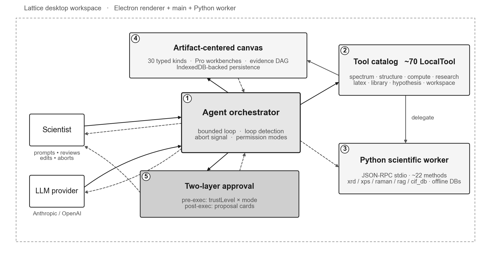
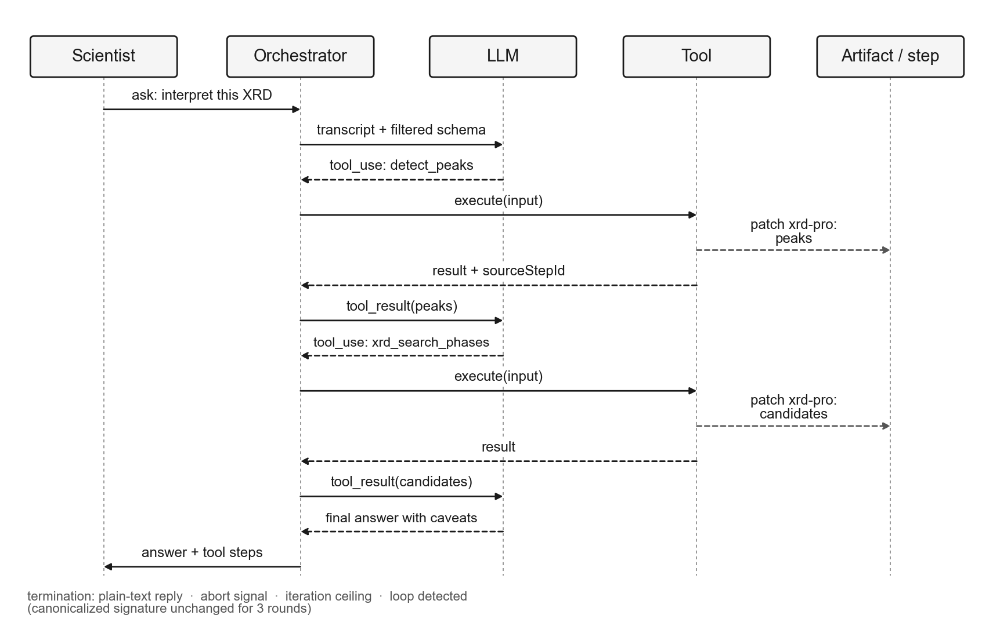
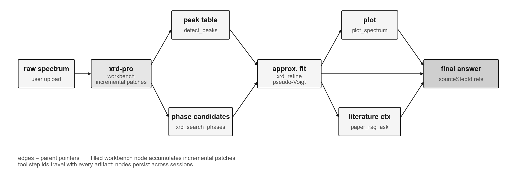
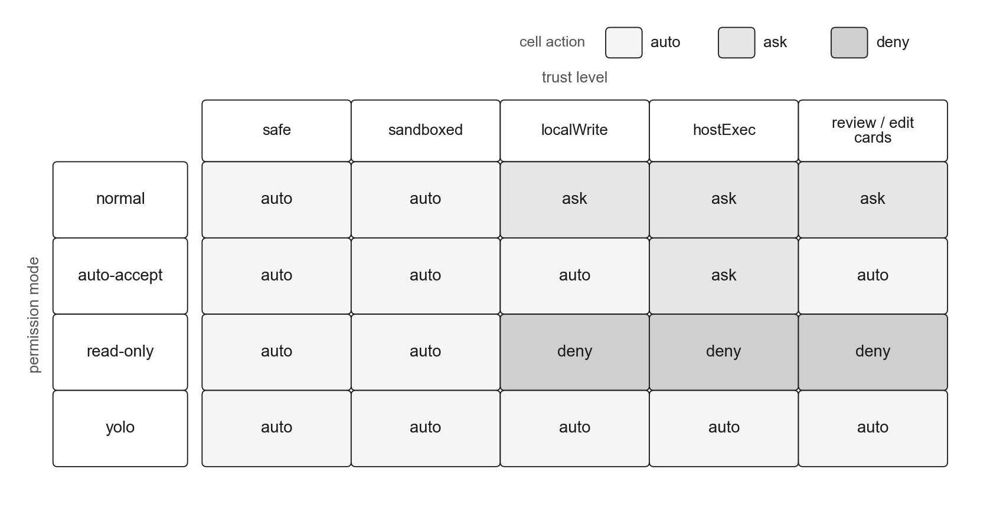

# C1 — A Human-in-the-Loop Workspace for Experimental Iteration

> Section draft for the paper body. English prose, ready to be lifted into the System Design / Contribution section.
> Last revised: 2026-04-29.

---

*Figure 1.  Lattice human-in-the-loop workspace.  Five subsystems share one process tree and one transcript timeline; every tool call, artifact mutation, approval state, and task step is time-aligned and auditable.*

Lattice is not a single analysis script, nor an autonomous materials-discovery engine. It is a desktop scientific workspace in which an LLM agent, a catalog of characterization tools, a long-lived Python worker, an artifact-centered canvas, and a human approval surface share a single, auditable execution loop. The contribution lies not in any individual component — multi-turn tool calling, function-calling agents, and approval-gated automation are all established ideas — but in their composition into one application that a user can open, point at a spectrum, and use to drive a tool-grounded interpretation through to a reviewed conclusion. The unit of value Lattice exposes is therefore not "a better answer" but *a workspace in which the cost — both in expertise and in time — of producing a defensible spectrum interpretation is low enough that the user, specialist or not, will actually carry the analysis through*.

We describe the five subsystems that realize this claim.

## Agent orchestrator

*Figure 2.  One agent turn = LLM call + tool fan-out + tool_result fold-back.  AbortSignal threads through every layer; loop detection terminates on canonicalized iteration signature.*

At the centre of every session is a bounded, multi-turn orchestrator that mediates each exchange between the user and the language model. A turn proceeds in three phases: the orchestrator builds a prompt from the current transcript and a context-filtered tool schema, dispatches the model call, and — if the model emits one or more `tool_use` blocks — executes the corresponding tools, folding their outputs back into the next prompt as `tool_result` messages. The loop terminates when the model returns a plain text reply, when an abort signal is raised, when an iteration ceiling is reached, or when a stuck-loop heuristic decides that the same tool calls are being issued without progress.

Two design choices distinguish this loop from a generic ReAct-style runner. First, the loop is *bounded by canonicalized iteration signatures*: each round's tool calls are sorted, serialized and compared against recent rounds, so that pathological repetition can be detected and aborted without imposing a hard token budget on legitimate multi-step analyses. Second, the loop is *interruptible at every depth*. A single `AbortSignal` flows from the cancel button in the UI through the streaming model request, into every executing tool, and into any pending approval prompt. A scientist who notices a wrong direction can stop the loop without leaving the workspace in an inconsistent state. A session-level permission mode — `normal`, `auto-accept`, `read-only`, or `yolo` — adjusts the threshold at which the loop pauses for human input, letting the same orchestrator serve both careful inspection on a sensitive sample and high-throughput evaluation runs across a parameter sweep.

## Tool catalog

The agent's capabilities are exposed through a typed tool catalog spanning the materials-characterization workflow end-to-end. Tools fall into eight functional groups: XRD, XPS, Raman, and general-spectrum analysis; crystal structure construction and modification; compute-script authoring and execution; literature search, PDF ingestion, and retrieval-augmented question answering; LaTeX authoring and citation handling; hypothesis tracking; workspace filesystem access; and a small set of meta-tools for task management and tool discovery.

Every tool is declared as a `LocalTool` with a JSON-Schema input contract, a trust level, a UI card mode, and an `execute(input, ctx)` function. This contract makes the boundary between the language model and the host application fully declarative: the model cannot reach a side effect except through a registered tool, and the orchestrator has the metadata it needs to decide, on a per-call basis, whether to run silently, surface a result card, or pause for human review. Because exposing the entire catalog on every turn would bloat the schema and increase misuse, the orchestrator filters the catalog by session context — a session containing an XRD spectrum sees the spectrum and structure tools; a session focused on literature work sees a leaner subset. This filtering is the mechanism that lets Lattice scale beyond the half-dozen tools typical of demonstration agents without overwhelming the model.

## Python scientific worker

Numerical work is delegated to a long-lived Python subprocess that the Electron main process launches lazily and addresses through line-delimited JSON-RPC. The worker exposes routines for peak detection, smoothing and baseline subtraction, XRD phase search and approximate whole-pattern fitting, XPS charge correction and component fitting, Raman library matching, retrieval over imported papers, CIF database lookup, and PDF parsing. Reference databases — Materials Project XRD entries, XPS line tables with Scofield sensitivity factors, and Raman libraries — are bundled with the application, so that a typical characterization session runs without network access.

Separating the Python worker from the renderer process has two consequences for the workflow claim. It contains the heavyweight scientific dependencies inside a process that can be restarted without reloading the user interface, and it gives long-running tools a natural channel for streaming progress events back to the agent and the user. The boundary is also where Lattice keeps its honest scope statement: refinement is implemented as approximate whole-pattern pseudo-Voigt fitting rather than full Rietveld, and the worker surfaces this fact directly in tool outputs.

## Artifact workspace

*Figure 4.  Artifact evidence graph for an XRD interpretation.  Tools patch a Pro workbench rather than dumping text into chat; every artifact carries parents and the tool step that created it, so the final answer is fully traceable.*

A defining choice in Lattice is that tool outputs are not summarized into chat text and forgotten. Each meaningful output is materialized as a typed *artifact*: a spectrum, a peak table, a candidate-phase list, an approximate fit, a compute script, a literature record, a research report. Artifacts are addressable, cross-referenceable objects that live in an artifact-centered canvas alongside the conversation. Interactive *workbenches* — the XRD, XPS, Raman, and compute "Pro" panels — are themselves artifacts whose payloads agent tools incrementally patch as analysis proceeds. A `detect_peaks` call updates the peak table on the active workbench rather than dumping numbers into the chat, leaving the user with an inspectable, editable view rather than an opaque textual summary.

This artifact-first organization changes the unit of scientific reasoning from "the assistant's last message" to "the evidence graph that produced it." Each artifact records the tool step that created it and its parent artifacts, so a final answer can be traced back to the spectrum file it came from, with every intermediate decision visible and editable along the way. Artifacts persist across sessions through a two-tier storage scheme — fast-path browser storage for recent state, IndexedDB for sessions that exceed quota — so that an analysis the scientist began last week is still there next week, in its full inspectable form rather than as a summary they have to trust.

## Approval gates

*Figure 3.  Approval matrix.  Trust level is a property of the tool; permission mode is a property of the session.  The same tool implementation runs conservatively or aggressively without modification.*

The fifth subsystem is a two-layer approval mechanism that keeps the human in the loop on consequential steps without forcing them into the loop on trivial ones. Every tool declares a *trust level* describing the kind of effect it can produce: `safe` for read-only metadata, `sandboxed` for backend computation with no host write, `localWrite` for mutations to artifacts or workspace files, and `hostExec` for shell or script execution. Read-only and sandboxed tools execute without prompting. Tools that mutate workspace state or execute host code are gated *before* execution by the session's permission mode. A second class of tools — those that propose disk writes, script edits, or reviewable analyses — are additionally gated *after* execution by a card UI: the proposed change is rendered as a diff that the scientist can approve, edit, or reject before it is committed.

Separating trust level (a property of the tool) from permission mode (a property of the session) means the same workflow can run conservatively on a sensitive sample and aggressively on a parameter sweep, without modifying any tool implementation. Combined with the orchestrator's abort and loop-detection mechanisms, the result is a tractable safety surface: a small number of policy decisions that govern a much larger set of automated actions.

---

Together, these five subsystems compose into a workflow rather than a feature list. A user drops a spectrum into the workspace, asks an interpretive question, and watches the agent navigate a tool-grounded path: peaks are detected on the workbench, candidate phases are searched against a local database, an approximate fit is computed, plots are rendered as artifacts, and a final answer is composed only after the relevant intermediate evidence has been materialised. At each consequential step the user can intervene, edit, or steer; nothing the agent claims about the sample is untraceable to a tool result. This is the sense in which Lattice's contribution is *a workspace that lowers the expertise and time cost of materials spectrum analysis*: it does not replace the scientist with a model, and it does not aim at autonomous discovery. It absorbs part of the expertise barrier into the workspace itself, and gives the model and the user a shared, auditable surface on which their work can compose.
